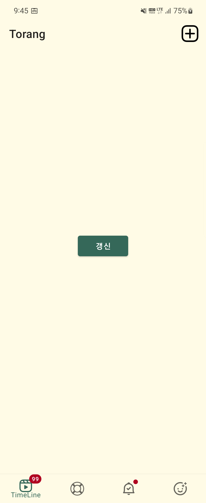

# 메인 모듈 (Main Module)

피드, 그리드 형식 피드, 리뷰 추가, 음식점 찾기, 프로필  5가지 화면을 제공하는 모듈

하위 모듈들의 최신 버전을 취합, 유기적으로 잘 동작하는지 확인하는 모듈

## 스크린샷

## 특징

### [BottomNavigationView와 NavigationComponent 사용](./documents/NavigationBar.md)

BottomNavigationView와 NavigationComponent를 연결하면 자동으로 최적의 탐색과 백스택 기능이 적용됩니다.
위 기능을 구현하는데에는 설정해야하는 사항이 많으므로 충분히 여유를 가지고 하나씩 문서를 확인해야합니다.
